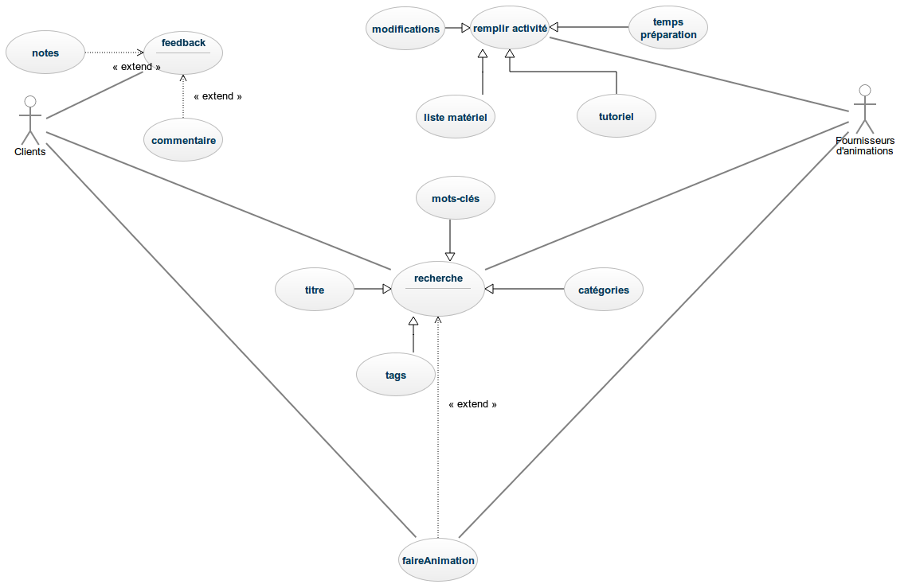

#I	Fondements du projet
##1. But du projet
###a. Problème de l’utilisateur ou contexte du projet 
L'idée de base est de permettre à des animateurs d'échanger des idées d'activités afin de pouvoir animer de diverse façon un groupe de personnes ou simplement s'inspirer afin de créer des animations. 
###b. Objectifs du projet
Créer une application pour smartphones gratuite, permettant d'échanger des idées d'activités entre animateurs ou tout autre personne souhaitant animer un groupe de personnes. L'objectif est d'atteindre 1 000 000 d'utilisateurs français en un ans puis, par la suite, étendre le réseau à l'internationnal.
##2. Personnes et organismes impliqués dans les enjeux du projet 
###a. Maître d’ouvrage
animatips
###b. Acheteur
Toutes personnes qui cherchent un moyen de pouvoir échanger et trouver des activités afin d'animer un groupe de personnes.
###c. Autre parties prenantes
N/A
##3. Utilisateurs du produit
###a.	Utilisateurs directs du produit
Le produit cible principalement des animateurs, de vacanciers par exemple, mais peut également être intéressant pour toutes personnes souhaitant animer un groupe (anniversaire, classe transplantée...). Le produit s'intéressera dans un premier temps à un public français, puis s'étendra par la suite à l'internationnal si l'objectif en France est atteint.
###b. Priorité assignée aux utilisateurs
N/A
###c. Implication nécessaire de la part des utilisateurs dans le projet
Commenter, donner son avis ou encore mettre une note aux activités proposées, et proposer soit même une activité afin d'améliorer continuellement l'application. Rendre vivante l'application avec des échanges constants. 
###d. Utilisateurs concernés par les opérations de maintenance du produit
Les utilisateurs ne sont pas concerné par les opérations de maintenance, seul les administrateurs de l'application le peuvent.
#II	Contraintes sur le projet 
##4. Contraintes non négociables
###a. Contraintes sur la conception de la solution
Il faut une base de donnée de départ contenant plusieurs activités pour pouvoir lancer l'application.
###b. Environnement de fonctionnement du système actuel
Android et iOS pour être disponible sur la majorité plateformes cellulaires.
###c. Applications « partenaires » (avec lesquelles le produit doit collaborer)
Les réseaux sociaux tels que Facebook ou Twitter.
###d. « COTS » : Progiciels ou composants commerciaux
N/A (l'application serait développé de A à Z par nos développeur)
###e. Lieux de fonctionnement prévus
France puis internationnal.
###f. De combien de temps les développeurs disposent-ils pour le projet ?
Les développeurs disposent d'un délais de 6 mois, à partir de la remise du cahier des charges.
###g. Quel est le budget affecté au projet ?
Le budget est estimé à 20 000 euros.
##5. Glossaire et conventions de dénomination
##6. Faits et hypothèses utiles
###a. Facteurs influençant le produit, mais qui ne sont pas des contraintes imposées sur les exigences
Publicité gratuite faite par des animateurs partageant l'application sur des réseaux sociaux dans des groupes constitués exclusivement de personnes qui font de l'animation.
###b. Hypothèses que l’équipe fait sur le projet 
N/A
#III	Exigences fonctionnelles
##7. Portée du travail
###a. La situation actuelle
Actuellement on peut trouver des propositions d'activités sur divers sites internet ou bien sur des forumes de discussions. L'application regroupera ces différentes fonctionnalitées et permettra aux utilisateurs de proposer leurs propres activités qui seront par la suite validées par les administrateurs de l'application.
###b. Contexte du travail
Le produit devra être capable de gérer une large base de données regroupant les informations sur les utilisateurs et les activités proposées. Il faudra également qu'une connexion via les comptes des réseaux sociaux partenaires soit possible.
###c. Division du travail en événements métier
N/A
##8. Portée du produit (cas d’utilisations)
###a. Limites du produit : diagramme de cas d’utilisation

###b. Description sommaire des cas d’utilisation
##9. Exigences fonctionnelles et exigences sur les données
###a. Exigences fonctionnelles
#IV	Exigences non fonctionnelles
##10. Ergonomie et convivialité du produit
###a. L’interface
###b. Le style du produit (packaging inclus)
##11. Facilité d’utilisation et facteurs humains 
###a. Facilité d’utilisation
L'application comportera diverses rubriques regroupant les activités. Les utilisateurs pourront faire des recherches par mots-clés et appliquer des filtres afin de permettre à chacun de trouver l'activité qui lui convient. 
###b. Personnalisation et internationalisation
Chaque utilisateurs peut soumettre aux administrateurs sa propre activité qui sera par la suite vérifiée et validées en fonction de sa pertinance. Le réseau sera dans un premier temps français puis s'étendra à l'internationnal suivant les résultats de l'application.
###c. Facilité d’apprentissage
N/A
###d. Facilité de compréhension et politesse
Les activités seront vérifiées par les administrateurs qui se chargeront de les intégrer à l'application, et les compléter si besoin, afin d'obtenir une description clair est précise de celles-ci. Une politique de politesse et de respect entre les utilisaterus sera mise en place, et tout personnes pourra signaler un utilisateur abusif. Les administrateurs se chargeront alors de vérifier l'exactitudes de l'informations et supprimeront l'utilisateur abusif si besoin.
###e. Exigences d’accessibilité
L'application sera accessible par l'intermédiaire de comptes individuels,sécurisés par un nom d'utilisateur et un mot de passe. L'application pourra également être accessible sous le statut de visiteur, ce qui ne nécéssitera pas la création d'un compte. Cependant le statut de visiteurs ne permet pas de soumettre une activité ou bien de donner un avis, il permet simplement d'accéder aux activités proposées.
##12. Fonctionnement du produit
###a. Rapidité d’exécution et temps de latence
Chargement quasi instantané du texte suivant la connexion internet puis chargement des images. 
###b. Exigences critiques de sûreté
###c. Précision et exactitude
N/A
###d. Fiabilité et disponibilité
Les activités doivent être fiable donc vérifié avant d'être posté. Quant à la disponibilité il faut que les maintenances se fassent de nuit lorsque le taux d'utilisation de l'application serait la plus basse afin d'assurer une disponibilité des serveurs de 8h à 22h. 
###e. Robustesse ou tolérance à un emploi erroné
Si une activité ne plait vraiment pas elle sera de nouveau vérifié par un administrateur et modifiée/supprimée.
###f. Capacité de stockage et montée en charge
L'application devra peser 200Mo maximum et disposera d'un serveur de 500Go adaptable aux besoins des utilisateurs. Plus d'utilisateurs implique un besoin de plus d'espace. 
###g. Adaptation du produit à une augmentation de volume à traiter
N/A
###h. Longévité
Aucune longévité prédéfinie. 
##13. Adéquation du produit avec son environnement
###a. Environnement physique prévu
###b. Environnement technologique prévu
###c. Applications « partenaires » (avec lesquelles le produit doit collaborer) 
###d. Approche « produit » prêt à être commercialisé
##14. Maintenance, support, portabilité, installation du produit
###a. Maintenance du produit 
###b. Conditions spéciales concernant la maintenance du produit
###c. Exigences en matière de support
###d. Exigences de portabilité
###e. Installation du système
##15. Sécurité
###a. Accès au système
###b. Intégrité
###c. Protection des données à caractère personnel
###d. Audit et traçabilité
###e. Protection contre les infections
##16. Exigences culturelles et politiques 
###a. Exigences culturelles
###b Exigence politiques
##17. Lois et standards influençant le produit
###a. Conformité avec la loi
###b. Conformité avec des standards
